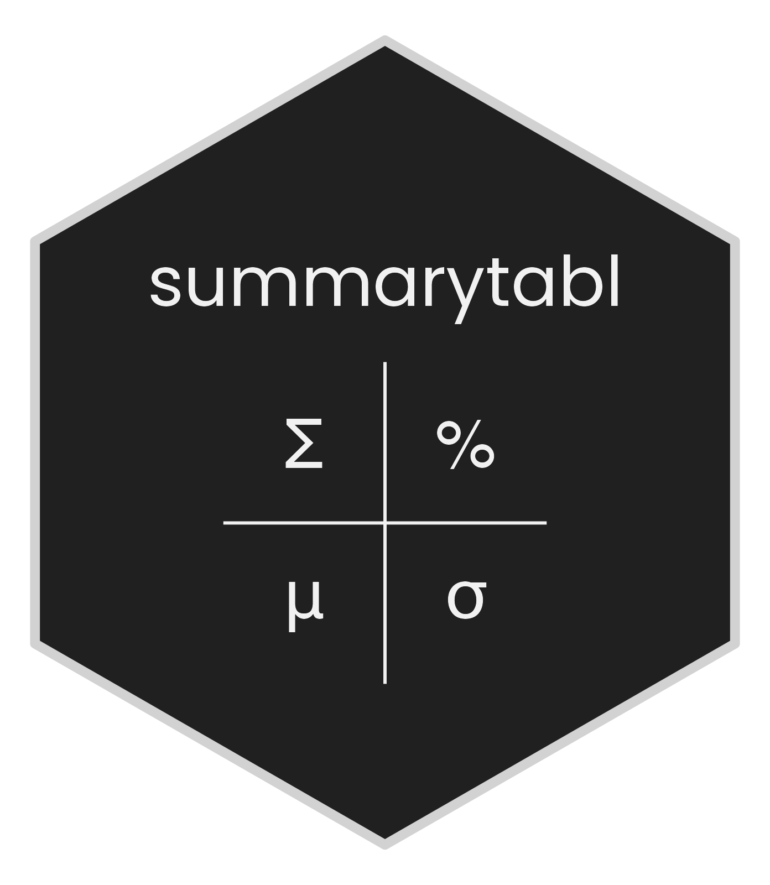

# summarytabl 

<!-- badges: start -->

[](https://CRAN.R-project.org/package=summarytabl)
[](https://github.com/anyamemensah/summarytabl/actions/workflows/R-CMD-check.yaml)
<!-- badges: end -->

**summarytabl** is a lightweight package that simplifies tabulating and
summarizing categorical, multiple response, ordinal, and continuous
variables.

## Installation

Install the **summarytabl** package from CRAN using the following
command:

``` r
install.packages("summarytabl")
```

For the latest updates, install the development version of the package
from GitHub:

``` r
remotes::install_github("anyamemensah/summarytabl", build_vignettes = TRUE)
```

## Learn more

Learn more about the package by browsing the [online
documentation](https://anyamemensah.github.io/summarytabl/) or reviewing
the introductory vignette:

``` r
vignette("summarytabl-intro", "summarytabl")
```

## Contribute to the Package

If you notice a bug or would like to make a suggestion about how to
improve the package, please [submit an
issue](https://github.com/anyamemensah/summarytabl/issues) or join the
discussion on a [pull
request](https://github.com/anyamemensah/summarytabl/pulls).
